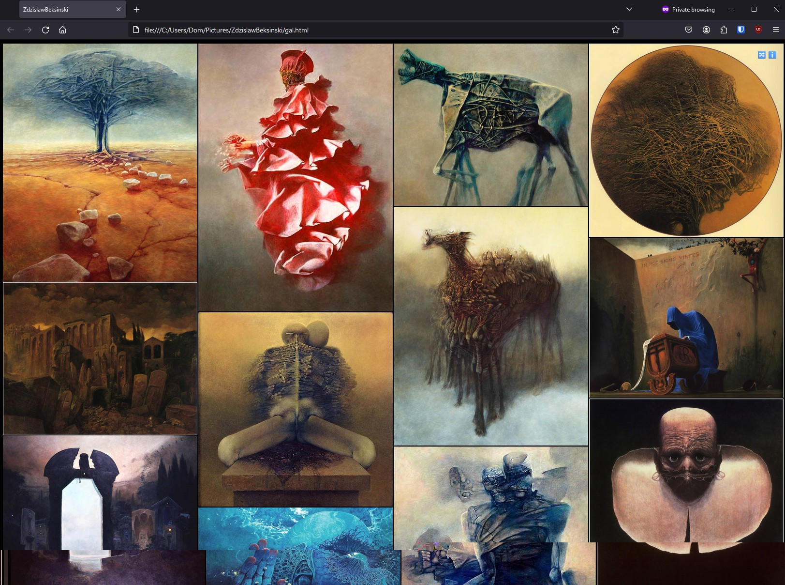

# go-masonry-gallery

This repo contains a CLI program that scans a directory for images and generates a simple HTML gallery using the experimental CSS [Masonry layout](https://developer.mozilla.org/en-US/docs/Web/CSS/CSS_grid_layout/Masonry_layout). The gallery file generated is left in the directory, so in the future, you can just open it in a browser.

### Features
- Generate a minified HTML gallery with a masonry layout
- Randomize the order of the images
- Select and filter a subset of the images

### Example output
[View the example-gallery in GitHub Pages](https://dominickp.github.io/gall/example-gallery/gal.html).


## Usage
Example with [The Works of Zdzisław Beksiński](https://archive.org/details/ZdzislawBeksinski/):
```
PS C:\Users\Dom\Pictures\ZdzislawBeksinski> gall .
2024/04/29 11:40:36 Directory to be scanned: .
2024/04/29 11:40:36 Found 88 images in the directory
2024/04/29 11:40:36 1 non-images were excluded from the gallery
2024/04/29 11:40:36 Gallery created: C:\Users\Dom\Pictures\ZdzislawBeksinski\gal.html
```



### Options

```sh
gall ./some-dir  	# Generate default gallery in directory
gall ./some-dir -f 	# launch with firefox
gall ./some-dir -b 	# launch default browser
```

## Enabling CSS Masonry in Firefox
At the time of writing this, to use the Masonry layout in Firefox, navigate to _about:config_ and set `layout.css.grid-template-masonry-value.enabled` to true.

## Notes
Example images generates with https://unsample.net/


## Template Placeholders
The file [template.html](./template.html) contains the unminified HTML template of the gallery page with a bit of CSS and JavaScript. This app simply loads that file and replaces the below placeholders with some text and HTML.

|Placeholder|Content|
|---|---|
|`<!-- GALLERY_CONTENTS -->`|Gallery images|
|`<!-- GALLERY_TITLE -->`|Gallery title|
|`<!-- GALLERY_INFO-->`|Gallery info|


## Context menu (windows)
To make this app a bit easier to use on my Windows 11 machine, I added it as an option to my context menu when right clicking a folder or the background pane of an open folder. This is what it looks like:


This uses a tool called [Nilesoft Shell](https://nilesoft.org/). Once installed, simply add the following to your [shell.nss](https://nilesoft.org/docs/get-started):

```
menu(type='back|dir' mode="multiple"  title='dominickp/gall' image=\uE1F4)
{
	item(title = 'Generate Gallery' cmd='gall' arg='.')
	item(title = 'Generate Gallery (launch Firefox)' cmd='gall' arg='. -f')
}
```

